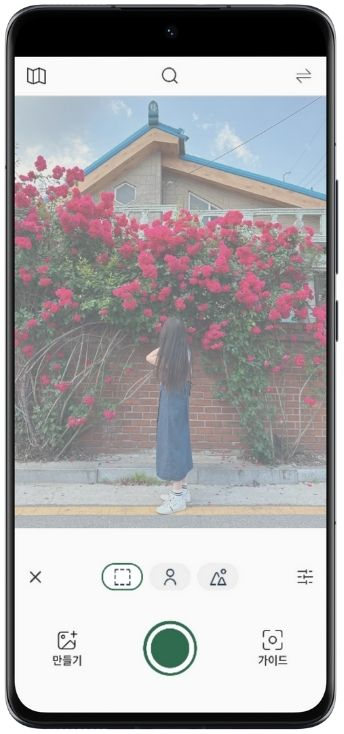
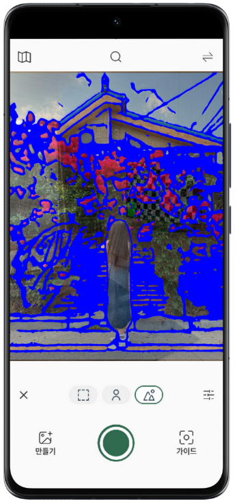
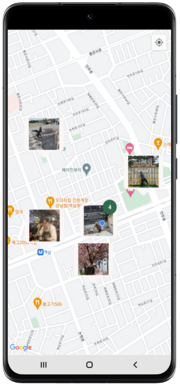
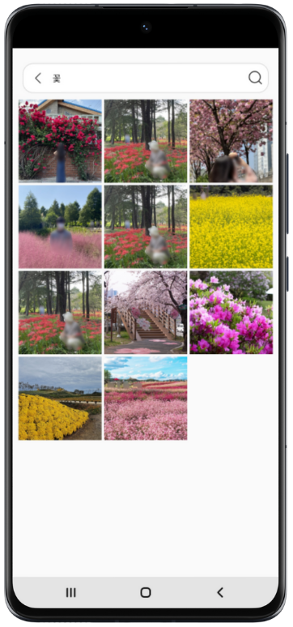
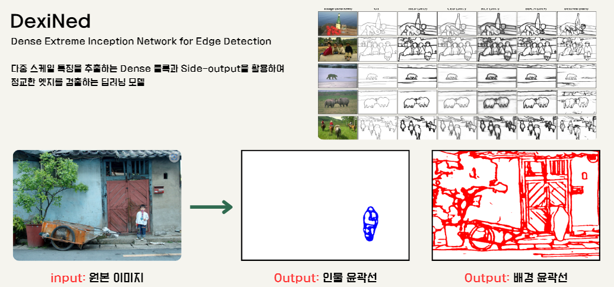
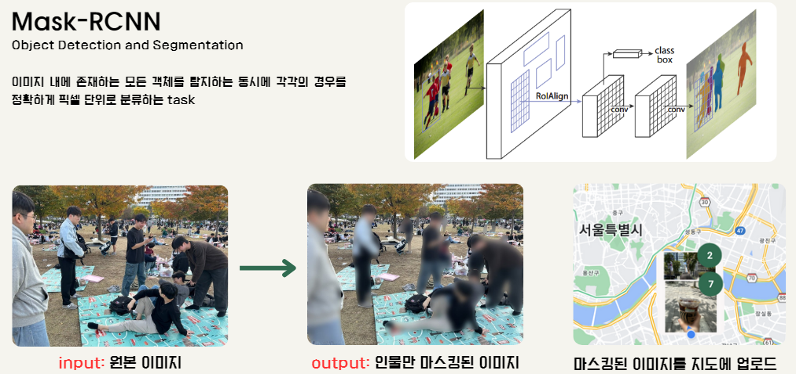
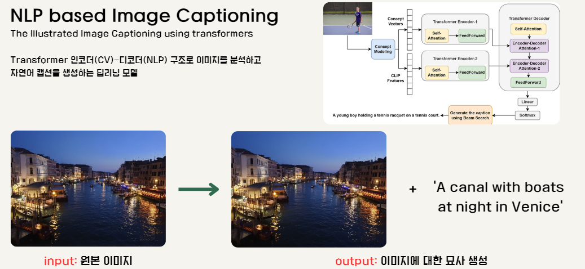
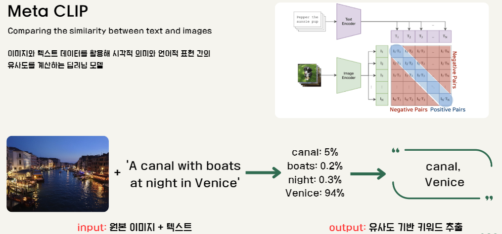
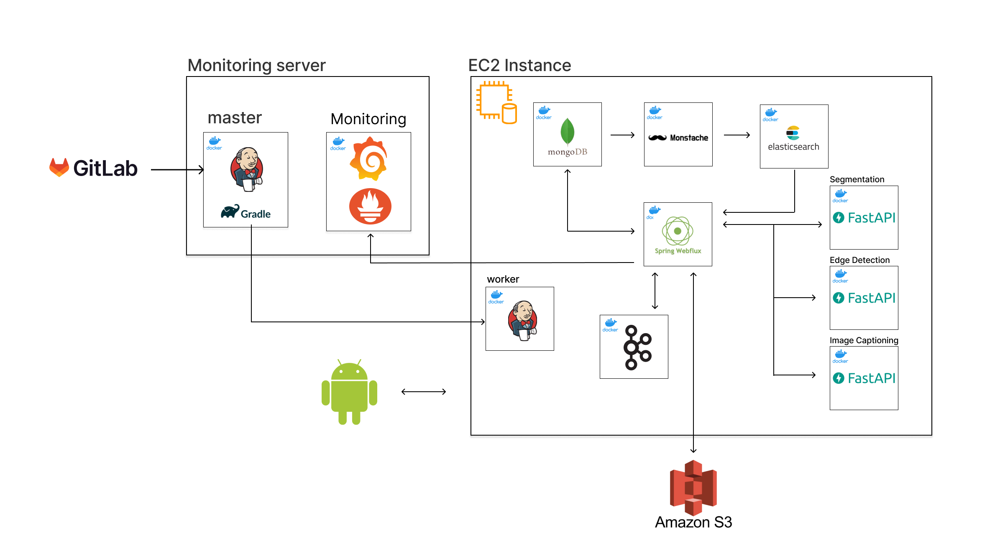

# 📸 MOOTD

## 📌 프로젝트 소개

**MOOTD**은 사용자가 사진 촬영 시 보다 나은 구도를 잡을 수 있도록 인물 및 배경에 대한 가이드라인을 제공하는 어플리케이션입니다.

사용자는 간편한 설정과 검색을 통해 원하는 가이드라인을 활용하여 원하는 구도로 사진을 찍을 수 있습니다.

## 💻 프로젝트 주요 기능

### 📸 가이드라인 제공

사용자가 원하는 구도로 사진을 찍을 수 있도록 가이드라인을 제공합니다.

- 다양한 가이드라인 제공:
  - 원본 이미지, 인물 윤곽선, 배경 윤곽선을 카메라 화면에 오버레이 형태로 표시.
  - 사용자 설정을 통해 가이드라인의 투명도를 조절 가능.
- 사용자 갤러리 활용:
  - 갤러리에 저장된 사진을 기반으로 가이드라인 생성.

|    원본 이미지 가이드라인    |      인물 가이드라인     | 배경 가이드라인 |
| :-------------------: | :-----------------: | :-------------: |
|  |  |  |

| 촬영하기 |
| :---: |
|  |

### 🔍 가이드라인 검색 

다른 사용자가 찍은 사진을 조회하여 해당 가이드라인을 사용할 수 있습니다. 사진은 초상권 보호를 위해 인물을 마스킹하여 제공합니다.

- 현재 위치 기반 이미지 검색
  - 특정 위치에서 다른 사용자가 찍은 사진을 조회.
  - 가독성을 높이기 위해 동일한 위치나 가까운 위치에 있는 사진들을 하나의 클러스터로 묶어 직관적으로 탐색 가능.
- 텍스트 기반 이미지 검색
  - 텍스트 키워드로 검색하여 다른 사용자가 찍은 사진을 조회.
  - 사용자가 입력한 이전 검색어를 기록하여 편리한 검색 환경 제공.

|       위치 기반 검색        |        텍스트 기반 검색           |
| :----------------------: | :----------------------: |
|  |  |

### 📂 가이드라인 관리

- 최근 사용 가이드라인 조회
  - 사용자가 최근 사용한 가이드라인을 쉽게 다시 적용 가능.
- 사용자 생성 가이드라인 저장:
  - 사용자가 생성한 가이드라인을 저장 및 관리.
  - 서버가 아닌 사용자의 기기에 저장하여 인터넷 없이 사용 가능.

## 🤖 사용된 AI 모델

### DexiNed
- 기능: 인물 및 배경 윤곽선 추출.
- 특징: Dense 블록과 Side-output을 활용한 정교한 엣지 검출.

 

### Mask-RCNN
- 기능: 초상권 보호를 위한 인물 마스킹.
- 특징: 이미지 내 객체를 픽셀 단위로 분류 및 탐지.

 
  

### NLP 기반 Image Captioning
- 기능: 이미지 태그 생성 및 텍스트 키워드 추출.
- 특징: Transformer 인코더-디코더 구조로 이미지 분석 및 캡션 생성.
- Meta CLIP: 이미지-텍스트 간 유사도 계산.

 
 

## 🧑🏻 팀원

### 🖥️ Client

| 김주연 | 정승훈 |
| :---: | :---: | 
|  |  | 
| [izodam](https://github.com/izodam) | [Jeongseunghun](https://github.com/Jeongseunghun)  |

### 🖥️ Server

| 김도훈 | 최재혁 | 
| :---: | :---: |
|  |  |
|[kdh610](https://github.com/kdh610) | [hoiae](https://github.com/hoiae) 
### 🖥️ AI

| 박정영 | 박경령 | 정승훈 |
| :---: | :---: | :---: |
|  |  |  | 
|[WiFros](https://github.com/WiFros) | [Kryoung1215](https://github.com/Kryoung1215) |  [Jeongseunghun](https://github.com/Jeongseunghun) |

### 🖥️ Infra

| 김도훈 | 최재혁 | 박정영 |
| :---: | :---: | :---: |
|  |  |  |
|[kdh610](https://github.com/kdh610) | [hoiae](https://github.com/hoiae) |[WiFros](https://github.com/WiFros) |

## ⚒️ 기술 스택

### 🖥️ Client

|  |  |
| :----- | :----- |
| Language             |                                                                                                         |
| Version Control      |                |
| IDE                  |                                                                                   |

### 🖥️ Server

|  |  |
| :-------------------: | :-------------- |
| Framework             |   |
| Language |   |
| Database              |    |
|Monitoring |  |
| Cloud                 |   |
| DevOps                |   |  
| Version Control       |   |
| IDE                   |  |

### 🖥️ Common

|  |  |
| :--- | :--- |
| Collaboration |     |

## 📚 산출물
|  |  |
| :--: | ---: |
| Architecture |  |
